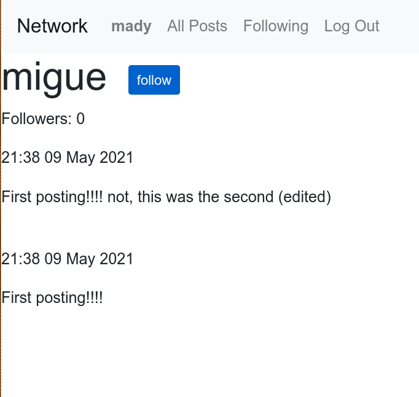
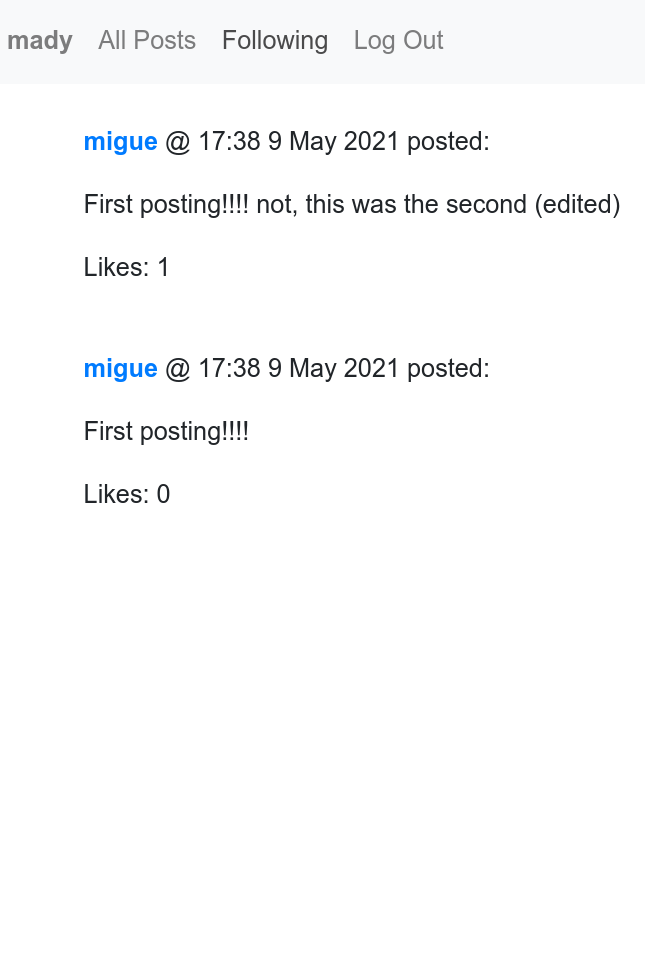
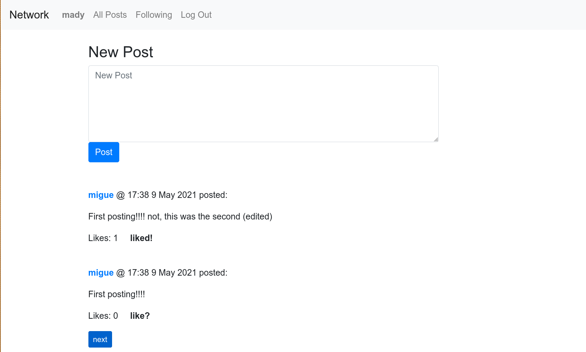

#Network
Network (like twitter) project for CS50 Web Programming with Python and Javascript.
RESTful project

###Main page and new post

###Following
####This is the profile page of the user

####You can follow the user

####So you go to your following interface and there is it.

###You can like the posts.
####before

####after

###editing a own post
####before

####after

Demostration:
https://youtu.be/pCOV_KV84x8